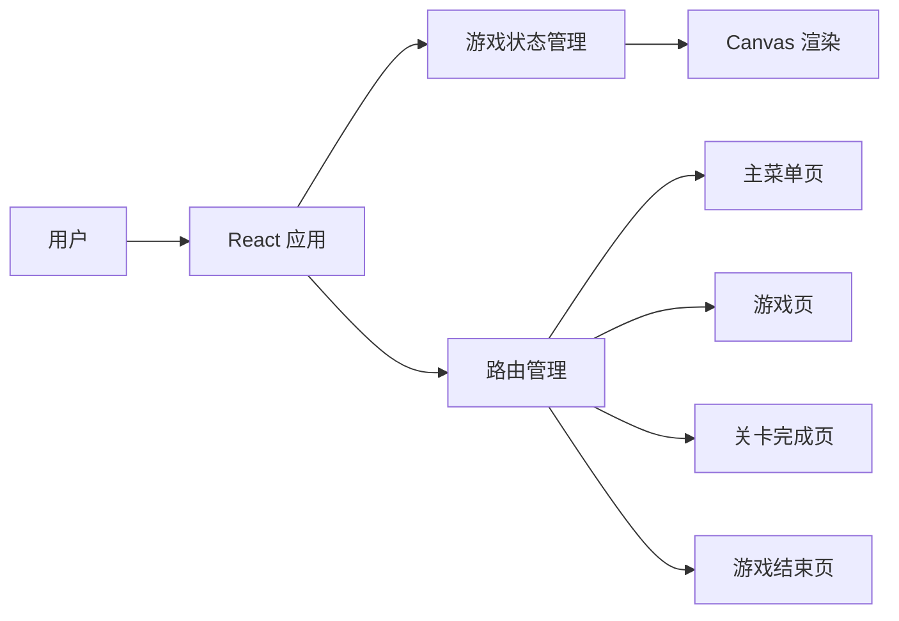

## 1. 架构设计
闯关游戏采用 React 前端架构，使用 Canvas 进行游戏渲染，无需后端服务。



## 2. 技术描述
- **前端**：React@18 + TypeScript + tailwindcss@3 + Vite
- **初始化工具**：vite-init
- **游戏渲染**：HTML5 Canvas API
- **状态管理**：React hooks (useState, useEffect, useRef)
- **动画**：requestAnimationFrame

## 3. 路由定义
| 路由 | 页面组件 | 功能 |
|------|---------|------|
| / | MainMenu | 主菜单页 |
| /game | Game | 游戏页 |
| /level-complete | LevelComplete | 关卡完成页 |
| /game-over | GameOver | 游戏结束页 |

## 4. 数据结构定义

### 4.1 游戏状态类型
```typescript
interface GameState {
  score: number;
  lives: number;
  level: number;
  isPaused: boolean;
  isGameOver: boolean;
  isLevelComplete: boolean;
}
```

### 4.2 游戏对象类型
```typescript
interface GameObject {
  x: number;
  y: number;
  width: number;
  height: number;
  velocityX: number;
  velocityY: number;
  color: string;
}

interface Player extends GameObject {
  isJumping: boolean;
  onGround: boolean;
}

interface Platform extends GameObject {
  type: 'normal' | 'moving';
  moveRange?: { start: number; end: number };
  speed?: number;
}

interface Collectible extends GameObject {
  type: 'star' | 'heart';
  collected: boolean;
}

interface Obstacle extends GameObject {
  type: 'spike' | 'enemy';
}
```

## 5. 核心模块
| 模块 | 职责 | 文件位置 |
|------|------|---------|
| 游戏引擎 | 游戏循环、碰撞检测、物理引擎 | src/utils/gameEngine.ts |
| 关卡生成 | 生成不同难度的关卡 | src/utils/levelGenerator.ts |
| Canvas 渲染 | 绘制游戏画面 | src/components/GameCanvas.tsx |
| 状态管理 | 管理游戏状态 | src/hooks/useGameState.ts |

## 6. 项目结构
```
/workspace
├── src/
│   ├── components/
│   │   ├── GameCanvas.tsx      # 游戏画布组件
│   │   ├── HUD.tsx             # HUD 显示组件
│   │   └── MainMenu.tsx        # 主菜单组件
│   ├── pages/
│   │   ├── MainMenuPage.tsx    # 主菜单页
│   │   ├── GamePage.tsx        # 游戏页
│   │   ├── LevelCompletePage.tsx  # 关卡完成页
│   │   └── GameOverPage.tsx    # 游戏结束页
│   ├── hooks/
│   │   ├── useGameState.ts     # 游戏状态钩子
│   │   └── useKeyboardControls.ts  # 键盘控制钩子
│   ├── utils/
│   │   ├── gameEngine.ts       # 游戏引擎
│   │   └── levelGenerator.ts   # 关卡生成器
│   ├── App.tsx                 # 应用入口
│   ├── main.tsx                # React 入口
│   └── index.css               # 全局样式
├── package.json
├── tsconfig.json
├── vite.config.ts
└── tailwind.config.js
```

