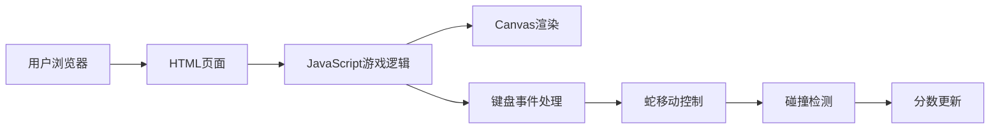

## 1. Architecture Design


## 2. Technology Description
- 前端: 原生 HTML5 + CSS3 + JavaScript
- 渲染: HTML5 Canvas 2D
- 无需后端和数据库，纯前端应用

## 3. Route Definitions
| Route | Purpose |
|-------|---------|
| / | 游戏主页面 |

## 4. API Definitions
无需后端API，纯前端实现。

## 5. Server Architecture Diagram
不适用，无后端服务。

## 6. Data Model
无需数据库，游戏状态使用 JavaScript 变量管理。

### 6.1 游戏状态数据结构
```javascript
// 游戏状态
const gameState = {
    running: false,
    paused: false,
    score1: 0,
    score2: 0
};

// 蛇的数据结构
const snake1 = {
    body: [{x: 5, y: 10}],
    direction: 'right',
    color: '#4ade80'
};

const snake2 = {
    body: [{x: 35, y: 10}],
    direction: 'left',
    color: '#f87171'
};

// 食物的数据结构
const food = {
    x: 20,
    y: 10,
    color: '#fbbf24'
};
```

### 6.2 控制按键映射
```javascript
// 玩家1: W/A/S/D
// 玩家2: 方向键 ↑/←/↓/→
```
