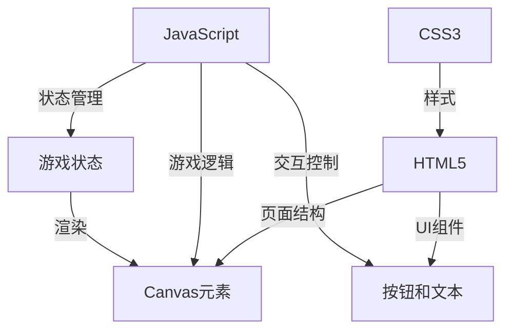

## 1. Architecture Design
纯前端应用架构，使用HTML5、CSS3和原生JavaScript实现，无需后端服务。



## 2. Technology Description
- 前端: HTML5 + CSS3 + 原生JavaScript (ES6+)
- 游戏渲染: HTML5 Canvas
- 状态管理: 原生JavaScript变量和对象
- 无后端依赖
- 无数据库需求

## 3. File Structure
```
tanchishe/
├── index.html          # 主HTML文件
├── css/
│   └── style.css       # 样式文件
├── js/
│   └── game.js         # 游戏逻辑文件
└── README.md           # 项目文档
```

## 4. Core Modules

### 4.1 Game State
```javascript
const gameState = {
    score: 0,
    highScore: 0,
    isPlaying: false,
    isPaused: false,
    snake: [],
    food: null,
    direction: 'right',
    nextDirection: 'right',
    gridSize: 20,
    speed: 150
};
```

### 4.2 Game Logic Functions
- `initGame()`: 初始化游戏
- `startGame()`: 开始游戏
- `pauseGame()`: 暂停游戏
- `resetGame()`: 重置游戏
- `update()`: 更新游戏状态
- `draw()`: 渲染游戏画面
- `checkCollision()`: 碰撞检测
- `generateFood()`: 生成食物
- `handleKeyPress()`: 处理键盘输入

## 5. Key Implementation Details

### 5.1 Snake Movement
使用数组存储蛇的每个身体部分坐标，每次移动时：
- 计算新的蛇头位置
- 检查是否吃到食物
- 如吃到食物则不删除蛇尾，否则删除蛇尾
- 将新蛇头添加到数组开头

### 5.2 Game Loop
使用 `setInterval` 实现游戏主循环，每次循环执行：
- 更新游戏状态
- 渲染画面

### 5.3 Responsive Design
使用 CSS 媒体查询和相对单位实现响应式布局，在移动设备上调整画布大小和按钮尺寸。

