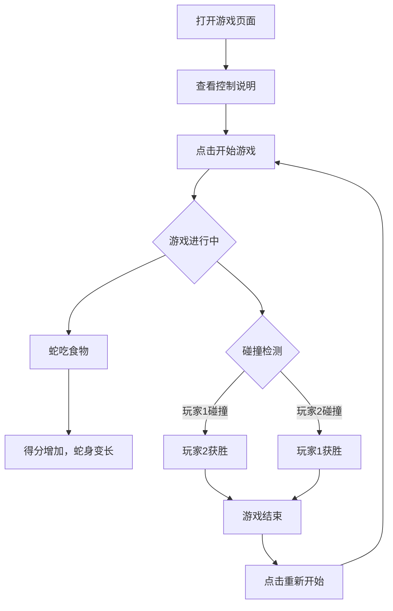

## 1. Product Overview
双蛇对战游戏是一个基于浏览器的多人互动游戏，允许两个玩家在同一个游戏界面中控制各自的蛇进行对战，体验竞技乐趣。
- 主要目的是提供一个有趣的双人对战游戏，增强互动性和竞技性
- 目标用户是喜欢经典贪吃蛇游戏并想要与朋友对战的玩家

## 2. Core Features

### 2.1 User Roles
| Role | Registration Method | Core Permissions |
|------|---------------------|------------------|
| 玩家1/玩家2 | 无需注册 | 控制自己的蛇进行游戏 |

### 2.2 Feature Module
1. **游戏主页面**: 游戏画布、分数显示、控制说明、游戏状态
2. **游戏界面**: 两条蛇的渲染、食物生成、碰撞检测

### 2.3 Page Details
| Page Name | Module Name | Feature description |
|-----------|-------------|---------------------|
| 游戏主页面 | 游戏画布 | 使用Canvas渲染游戏画面，包含两条蛇和食物 |
| 游戏主页面 | 分数显示 | 实时显示两位玩家的分数 |
| 游戏主页面 | 控制说明 | 显示两位玩家的控制按键 |
| 游戏主页面 | 游戏控制 | 开始、暂停、重新开始游戏功能 |

## 3. Core Process
用户打开游戏页面 → 查看控制说明 → 点击开始游戏 → 两位玩家分别控制自己的蛇 → 吃到食物得分，蛇身变长 → 发生碰撞判定胜负 → 游戏结束，可以重新开始

## 4. User Interface Design
### 4.1 Design Style
- 主色调：深蓝色背景 (#0a192f)，配合鲜明的蛇身颜色
- 玩家1蛇身：亮绿色 (#4ade80)
- 玩家2蛇身：亮红色 (#f87171)
- 食物：金色 (#fbbf24)
- 按钮风格：圆角、渐变、悬停效果
- 字体：现代无衬线字体，大号数字显示分数
- 布局风格：居中布局，游戏画布居中，两侧显示控制说明
- 图标风格：使用游戏相关的emoji

### 4.2 Page Design Overview
| Page Name | Module Name | UI Elements |
|-----------|-------------|-------------|
| 游戏主页面 | 游戏画布 | 深色背景，网格参考线，蛇身和食物有明显视觉区分 |
| 游戏主页面 | 分数显示 | 大号数字，实时更新，玩家1和玩家2分数分别显示 |
| 游戏主页面 | 控制说明 | 卡片式布局，清晰的按键图例 |
| 游戏主页面 | 游戏控制 | 醒目的按钮，悬停有动画效果 |

### 4.3 Responsiveness
桌面端优先，适配主流屏幕尺寸，支持键盘操作。

### 4.4 3D Scene Guidance
不适用，本项目为2D Canvas游戏。
