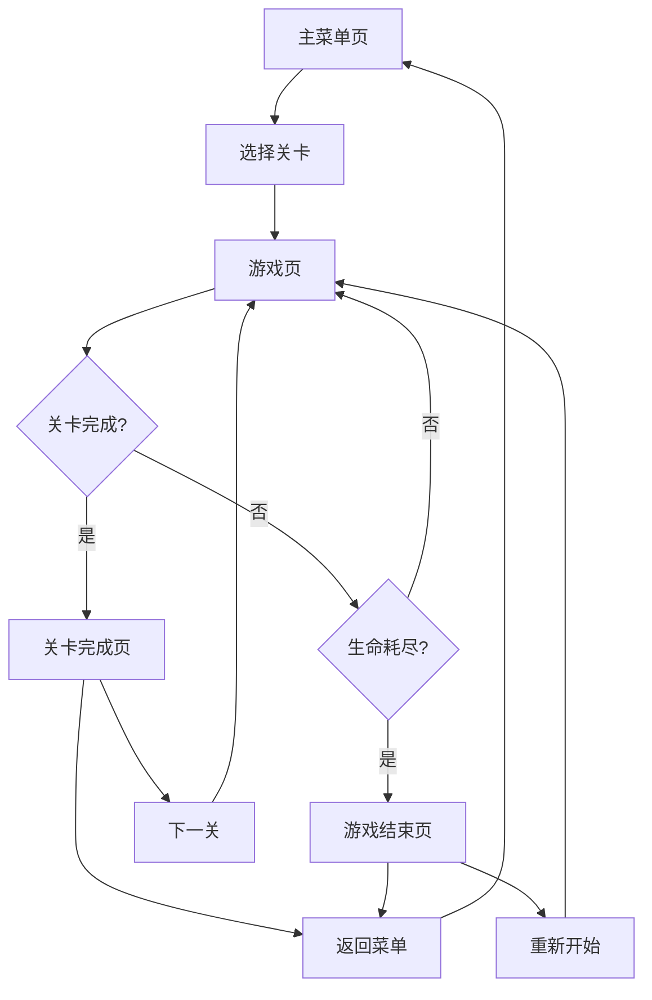

## 1. 产品概述
一款基于 React + Canvas 的闯关小游戏，包含多关卡挑战，玩家通过键盘控制角色移动和跳跃，收集道具并避免障碍物。
- 目标用户：休闲游戏爱好者
- 产品价值：提供简单有趣的闯关体验，适合碎片化时间游玩

## 2. 核心功能

### 2.1 用户角色
| 角色 | 注册方式 | 核心权限 |
|------|----------|----------|
| 玩家 | 无需注册 | 游戏游玩、关卡选择、分数统计 |

### 2.2 功能模块
1. **主菜单页**：游戏标题、开始按钮、关卡选择、游戏说明
2. **游戏页**：Canvas 游戏画面、得分显示、生命值、关卡信息
3. **关卡完成页**：关卡完成动画、得分统计、下一关按钮
4. **游戏结束页**：游戏结束动画、重新开始按钮

### 2.3 页面详情
| 页面名称 | 模块名称 | 功能描述 |
|---------|---------|---------|
| 主菜单页 | 游戏标题 | 动画标题展示 |
| 主菜单页 | 关卡选择 | 选择不同难度的关卡 |
| 主菜单页 | 游戏说明 | 简单的操作说明 |
| 游戏页 | 游戏画布 | Canvas 渲染游戏场景 |
| 游戏页 | HUD 界面 | 显示得分、生命、关卡信息 |
| 游戏页 | 暂停功能 | 暂停/继续游戏 |
| 关卡完成页 | 完成动画 | 关卡通过动画效果 |
| 关卡完成页 | 下一关 | 进入下一关或返回菜单 |
| 游戏结束页 | 结束动画 | 游戏结束动画效果 |
| 游戏结束页 | 重新开始 | 重新开始游戏 |

## 3. 核心流程
玩家在主菜单选择关卡 → 进入游戏界面控制角色移动跳跃 → 收集道具、避免障碍物 → 到达终点完成关卡或生命值耗尽游戏结束。

## 4. 用户界面设计

### 4.1 设计风格
- **主色调**：深蓝色 (#1a365d)、亮蓝色 (#3182ce)
- **辅助色**：黄色 (#ecc94b)、红色 (#e53e3e)
- **按钮风格**：圆角矩形，带有渐变色和阴影效果
- **字体**：使用 Orbitron（标题）和 Roboto（正文）
- **布局风格**：居中布局，卡片式设计
- **动画**：平滑的过渡动画、按钮悬停效果、粒子特效

### 4.2 页面设计概述
| 页面名称 | 模块名称 | UI 元素 |
|---------|---------|---------|
| 主菜单页 | 游戏标题 | 霓虹效果，动画加载 |
| 主菜单页 | 菜单按钮 | 渐变背景，悬停放大 |
| 游戏页 | Canvas | 全屏游戏画面 |
| 游戏页 | HUD | 半透明背景，白色文字 |
| 关卡完成页 | 完成界面 | 胜利特效，金色装饰 |
| 游戏结束页 | 结束界面 | 红色渐变，重启按钮 |

### 4.3 响应式设计
- 桌面端优先，适配 1080p 和 4K 分辨率
- 移动端适配，触摸优化控制
- 自适应 Canvas 尺寸

### 4.4 游戏场景设计
- **背景**：渐变天空，带有移动的云朵
- **关卡**：随机生成平台，包含多种地形
- **角色**：可爱的方块小人，带有简单动画
- **道具**：发光的星星（加分）、爱心（回血）
- **障碍物**：尖刺、移动平台、敌人

