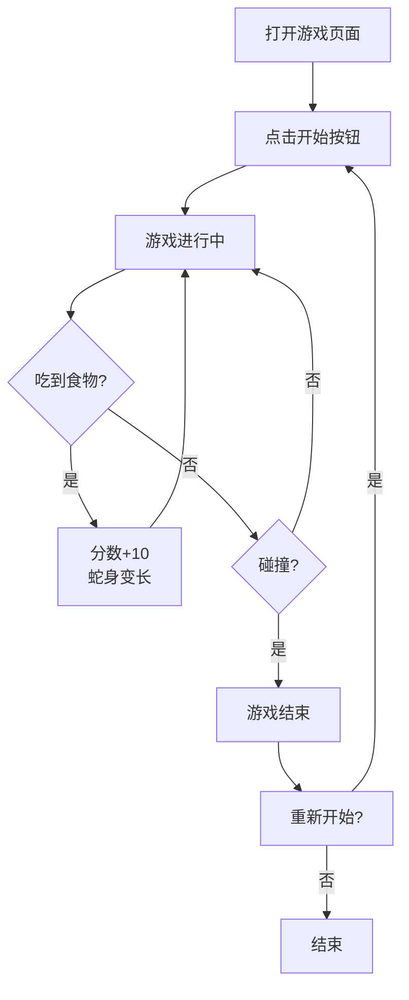

## 1. Product Overview
一个经典的贪吃蛇游戏项目，使用现代Web技术实现，提供流畅的游戏体验和美观的用户界面。
- 为休闲游戏玩家提供一个简单有趣的贪吃蛇游戏
- 目标是创建一个可在浏览器中直接运行的高质量游戏应用

## 2. Core Features

### 2.1 Feature Module
1. **游戏主页面**: 游戏画布、控制面板、分数显示
2. **游戏状态管理**: 开始/暂停/重新开始功能
3. **碰撞检测系统**: 墙壁碰撞和自身碰撞检测

### 2.3 Page Details
| Page Name | Module Name | Feature description |
|-----------|-------------|---------------------|
| 游戏主页面 | 游戏画布 | HTML5 Canvas渲染游戏画面，显示蛇和食物 |
| 游戏主页面 | 分数显示 | 实时显示当前得分和最高分 |
| 游戏主页面 | 控制面板 | 提供开始、暂停、重新开始按钮 |
| 游戏主页面 | 操作说明 | 显示键盘控制说明 |

## 3. Core Process
用户打开游戏页面 → 点击开始按钮开始游戏 → 使用方向键控制蛇的移动 → 吃到食物增加分数和蛇身长度 → 撞到墙壁或自身则游戏结束 → 可重新开始游戏

## 4. User Interface Design
### 4.1 Design Style
- 主色调：深绿色 (#0f172a) 搭配亮绿色 (#4ade80)
- 辅助色：红色 (#ef4444) 用于食物
- 按钮风格：圆角矩形，有轻微的阴影和悬停效果
- 字体：使用现代无衬线字体
- 布局风格：居中卡片式布局
- 图标：使用简洁的几何图形

### 4.2 Page Design Overview
| Page Name | Module Name | UI Elements |
|-----------|-------------|-------------|
| 游戏主页面 | 游戏画布 | 深色背景，网格线，蛇用绿色方块，食物用红色圆形 |
| 游戏主页面 | 分数面板 | 顶部显示，大号字体，亮绿色 |
| 游戏主页面 | 控制面板 | 底部排列，三个按钮，响应式布局 |

### 4.3 Responsiveness
桌面端优先设计，支持移动端自适应，在小屏幕上调整游戏区域大小和按钮布局

